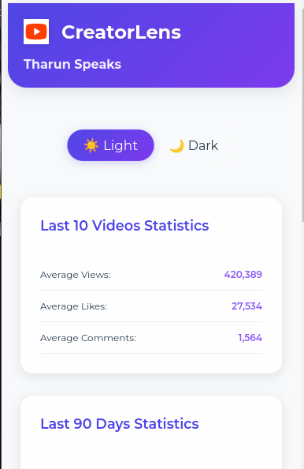

# CreatorLens - Advanced YouTube Analytics

Transform your YouTube analytics experience with CreatorLens, your comprehensive tool for channel insights and growth metrics.

## Key Features

- **Detailed Video Analytics**: Track views, likes, and comments
- **Channel Health Metrics**: Monitor engagement rates and growth patterns
- **Upload Consistency Tracking**: Analyze your content schedule
- **90-Day Performance**: Get deep insights into your channel's trends
- **Export Data**: Export your analytics data for further analysis
- **Most Popular Video Analysis**: Identify and analyze your most popular videos

## Setup Instructions
**1. Installation**
 
Download and extract the CreatorLens extension package to your local machine.

**2. Access Extensions**
 
Navigate to Chrome Extensions by entering `chrome://extensions/` in your browser address bar.

**3. Developer Settings**
 
Enable Developer Mode using the toggle switch in the top-right corner.

**4. Install Extension**
 
Click "Load Unpacked" and select the CreatorLens folder from your download location.

**5. Activate Extension**
 
Click the puzzle piece icon in Chrome's toolbar and pin CreatorLens for quick access.

## New Features
- Enhanced UI with modern design
- Channel health score
- Upload consistency analysis
- Engagement rate tracking
- Export Data
- Most Popular Video Analysis

*Get YouTube Analytics with Ease!*
 
**Now, visit YouTube, and you'll find access to analytics with ease using CreatorLens.**
 
Enjoy a clean and neat analytics experience!

**DEMO**
 

## DEMO

### Video:

### Photo:

